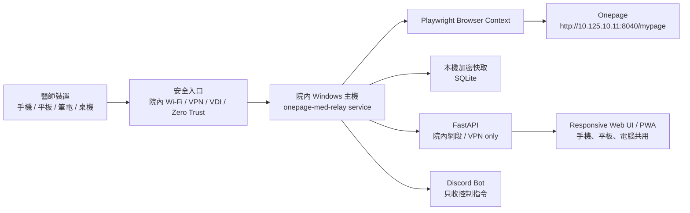
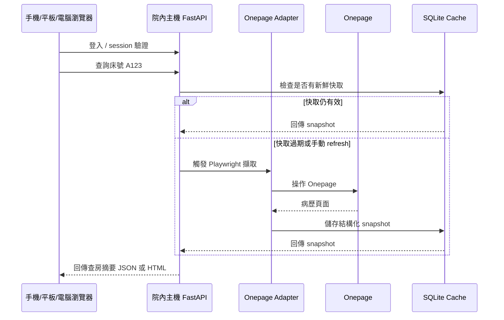
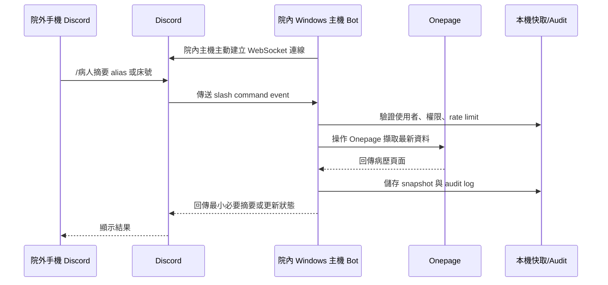

# Onepage 病歷彙整工具架構方案

## 目標

建立一個院內主機常駐的病歷彙整工具，透過操作院內 Onepage 病歷讀取網頁：

- 院內可用電腦、手機、平板快速查詢病人最新資訊，供查房使用。
- 自動整理 `vital sign`、抽血數值、影像報告、用藥與最近病程重點。
- 院外需要追蹤時，透過院內主機代為查詢，但不讓 Discord 或一般聊天平台直接承載完整病歷資料。
- 沿用 `punch_relay` 的可行經驗：Windows 常駐服務、NSSM 自動重啟、`.env` 管理內網網址、日誌、狀態檔、遠端指令入口。

## 核心原則

1. 病歷資料只由院內主機接觸 Onepage。
2. 院外只透過受控、加密、可稽核的入口讀取必要摘要。
3. Discord 只能作為控制與通知通道，不直接回傳病人姓名、病歷號、完整檢驗值或影像報告。
4. 所有查詢都要留下 audit log：使用者、時間、病人代碼、查詢類型、來源 IP 或指令來源。
5. 本機快取必須有保存期限，預設只留最近 24-72 小時，且需要加密或至少限制 OS 使用者權限。

## 系統總覽



## 和 `punch_relay` 可共用的設計

`punch_relay` 的重點不是打卡邏輯，而是「院內 Windows 主機作為內網代理」這個部署模式。建議沿用：

- 用 NSSM 安裝為 Windows service，開機自動啟動。
- 服務異常退出後自動重啟。
- `.env` 保存 `ONEPAGE_BASE`、Discord token、允許使用者清單等設定。
- 啟動時檢查必要設定，缺少設定就停止啟動。
- 單一 instance mutex，避免兩個 process 同時操作 Onepage session。
- stdout/stderr 寫入 UTF-8 log file。
- runtime state JSON 記錄 `running`、`clean_exit`，偵測上次是否異常中斷。
- 提供 `restart_agent.ps1`、`agent_status.ps1` 供一般使用者維護。

不建議共用的部分：

- 不要把病歷資料直接送進 Discord message。
- 不要把帳密明文存在一般 JSON。
- 不要讓外部指令可以任意查任意病人，必須限制使用者與查詢範圍。

## 建議 Repo 結構

```text
onepage-med-relay/
  agent/
    main.py
    config.py
    logging_setup.py
    single_instance.py
    service_state.py
    onepage/
      browser.py
      session.py
      patient_search.py
      vitals.py
      labs.py
      imaging.py
      medications.py
      notes.py
    summary/
      model.py
      normalize.py
      rounding_summary.py
      lab_trends.py
      abnormal_flags.py
    storage/
      db.py
      schema.sql
      encryption.py
      audit.py
      retention.py
    api/
      server.py
      auth.py
      routes_patients.py
      routes_admin.py
    bot/
      discord_control.py
      commands.py
  ui/
    web/
      index.html
      src/
  scripts/
    install_nssm_service_admin.ps1
    restart_agent.ps1
    agent_status.ps1
    setup_python_env.ps1
  docs/
    onepage_dom_notes.md
    security_model.md
  .env.example
  README.md
```

## 第一版 MVP 範圍

第一版不要直接做成大型 AI 病摘。先完成穩定資料擷取與查房摘要。

### 必做功能

- 輸入病歷號、住院號或床號查詢病人。
- 擷取最新 vital sign。
- 擷取最近 24-72 小時 labs。
- 擷取最近影像報告 impression。
- 產生純文字查房摘要。
- 院內 responsive Web UI 顯示摘要，手機、平板、電腦都可用。
- 所有查詢寫 audit log。
- 一鍵重新整理病人資料。

### 暫緩功能

- 自動長篇病摘。
- 外部 LLM 摘要。
- 批次追蹤所有住院病人。
- Discord 直接回傳完整病歷內容。
- 自動醫囑建議。

## 資料模型

### PatientSnapshot

```json
{
  "snapshot_id": "uuid",
  "patient_ref": "hashed-or-local-id",
  "bed": "A123",
  "source": "onepage",
  "fetched_at": "2026-07-06T08:30:00+08:00",
  "vitals": {},
  "labs": [],
  "imaging": [],
  "medications": [],
  "notes": []
}
```

### VitalSign

```json
{
  "time": "2026-07-06T08:00:00+08:00",
  "bt": 37.8,
  "hr": 102,
  "rr": 20,
  "bp_systolic": 138,
  "bp_diastolic": 82,
  "spo2": 96,
  "oxygen": "NC 2L"
}
```

### LabResult

```json
{
  "time": "2026-07-06T06:12:00+08:00",
  "name": "WBC",
  "value": 14200,
  "unit": "/uL",
  "flag": "high",
  "previous_value": 11800,
  "trend": "up"
}
```

### ImagingReport

```json
{
  "time": "2026-07-05",
  "modality": "CXR",
  "title": "Chest PA",
  "impression": "Right lower lung infiltration.",
  "raw_text_ref": "local encrypted blob id"
}
```

## SQLite Schema 草案

```sql
CREATE TABLE patient_snapshots (
  id TEXT PRIMARY KEY,
  patient_ref TEXT NOT NULL,
  bed TEXT,
  fetched_at TEXT NOT NULL,
  raw_hash TEXT,
  summary_text TEXT,
  expires_at TEXT NOT NULL
);

CREATE TABLE vitals (
  id TEXT PRIMARY KEY,
  snapshot_id TEXT NOT NULL,
  measured_at TEXT NOT NULL,
  bt REAL,
  hr INTEGER,
  rr INTEGER,
  bp_systolic INTEGER,
  bp_diastolic INTEGER,
  spo2 INTEGER,
  oxygen TEXT,
  FOREIGN KEY(snapshot_id) REFERENCES patient_snapshots(id)
);

CREATE TABLE labs (
  id TEXT PRIMARY KEY,
  snapshot_id TEXT NOT NULL,
  collected_at TEXT NOT NULL,
  name TEXT NOT NULL,
  value_text TEXT NOT NULL,
  value_number REAL,
  unit TEXT,
  flag TEXT,
  previous_value_text TEXT,
  trend TEXT,
  FOREIGN KEY(snapshot_id) REFERENCES patient_snapshots(id)
);

CREATE TABLE imaging_reports (
  id TEXT PRIMARY KEY,
  snapshot_id TEXT NOT NULL,
  reported_at TEXT,
  modality TEXT,
  title TEXT,
  impression TEXT,
  FOREIGN KEY(snapshot_id) REFERENCES patient_snapshots(id)
);

CREATE TABLE audit_logs (
  id TEXT PRIMARY KEY,
  actor TEXT NOT NULL,
  action TEXT NOT NULL,
  patient_ref TEXT,
  created_at TEXT NOT NULL,
  source TEXT,
  detail_json TEXT
);
```

## API 設計

FastAPI 只綁定在院內主機或 VPN 可到的位置。若要讓手機、平板與其他電腦使用，不能只綁 `127.0.0.1`，需要綁定院內網卡 IP，例如 `0.0.0.0` 或指定內網 IP，並用 Windows 防火牆限制只允許院內網段或 VPN 網段連線。

```text
GET  /health
POST /patients/refresh
GET  /patients/{patient_ref}/latest
GET  /patients/{patient_ref}/summary
GET  /patients/{patient_ref}/labs?hours=72
GET  /patients/{patient_ref}/imaging?days=14
GET  /audit/recent
POST /admin/restart-browser
```

`POST /patients/refresh` request:

```json
{
  "lookup_type": "bed",
  "lookup_value": "A123",
  "sections": ["vitals", "labs", "imaging"]
}
```

`GET /patients/{patient_ref}/summary` response:

```json
{
  "patient_ref": "local-id",
  "fetched_at": "2026-07-06T08:30:00+08:00",
  "summary": "Latest vitals...\nLabs...\nImaging...",
  "warnings": [
    "WBC rising",
    "Creatinine increased from baseline"
  ]
}
```

## 查房摘要規則

第一版用 deterministic rules，不急著接 AI。

### Vital Sign

- 顯示最新一筆。
- 若 24 小時內有 fever、tachycardia、hypotension、desaturation，列入 warning。
- 若有氧氣需求，顯示裝置與流量。

### Labs

- 只顯示常用核心項目：CBC、Cr/eGFR、Na/K、AST/ALT、bilirubin、CRP/PCT、lactate、PT/INR 等。
- 對每項顯示最新值與前值趨勢。
- abnormal 或變化大的項目優先。

### Imaging

- 顯示最近影像的 modality、日期、impression。
- 同一天多個影像依時間排序。
- 避免整段 findings 直接塞進摘要，第一版只抓 impression。

### Summary 範例

```text
床號 A123，更新 2026-07-06 08:30

Vitals:
T 37.8, HR 102, BP 138/82, SpO2 96% with NC 2L

Labs:
WBC 14.2k ↑ from 11.8k
Hb 10.1 stable
Cr 1.6 ↑ from 1.1
CRP 8.2 ↓ from 12.5

Imaging:
2026-07-05 CXR: RLL infiltration, no pleural effusion.

Watch:
- WBC rising despite CRP decreasing
- Renal function worsened compared with prior value
```

## 院外存取設計

院方若不能接受 ngrok、Cloudflare Tunnel、Tailscale Funnel 這類「從外部反向打進院內服務」的做法，就不要把院內 Web UI 暴露到院外。院外模式改成 `punch_relay` 類似的 Discord relay：院內主機主動連到 Discord，外部只透過 Discord 指令觸發查詢，沒有任何 inbound tunnel 或 public HTTP endpoint。

### 建議方案 A：院方 VPN 或 VDI

最建議。院外先進入院方核准的 VPN/VDI，再開院內主機 Web UI。

優點：

- 資安與法遵風險最低。
- 不需要把病歷資料送到第三方平台。
- 權限與稽核可以沿用院方既有機制。

### 建議方案 B：Zero Trust Tunnel

若院方允許，可用 Tailscale、Headscale、WireGuard 或 Cloudflare Zero Trust 類似架構。

必要條件：

- MFA。
- 僅允許你的帳號。
- API 必須要求登入。
- 所有查詢寫 audit log。
- 短效 session。
- 禁止公開網路匿名存取。

### 不建議方案：Discord 直接回病歷

不建議使用：

```text
/patient A123
Discord 直接回完整 vital/lab/imaging
```

原因：

- Discord 不是醫療資料系統。
- 訊息會留存在第三方服務。
- 轉傳、截圖、權限變更與 retention 難控管。

若一定要用 Discord，建議只做：

```text
/refresh A123
Bot: 已更新。請於 3 分鐘內到安全入口查看。
```

或只回傳非識別化狀態：

```text
Bot: A123 資料已更新，有 2 個 warning。請登入安全頁面查看。
```

## 跨裝置院內使用設計

你的需求應該以「內網 Web App」為主，而不是桌機程式。院內 Windows 主機負責連 Onepage 與整理資料；手機、平板、筆電、桌機只要能連到院內網路，就用瀏覽器開同一套查房介面。

### 連線方式

院內 Windows 主機提供 Web 服務：

```text
https://onepage-relay.local
```

開發初期也可以先用固定內網 IP：

```text
https://10.x.x.x:8765
```

建議順序：

1. 先用固定內網 IP 開發與測試。
2. 穩定後請資訊室或內網 DNS 設定好記的名稱，例如 `onepage-relay.local` 或院內 DNS 名稱。
3. 啟用 HTTPS，避免手機瀏覽器警告與內網明文傳輸。
4. 只允許院內 Wi-Fi、有線網路或 VPN 網段連線，不開放公網。

### 主機網路設定

院內主機需要：

- 固定內網 IP，或 DHCP reservation。
- Windows 防火牆只開放服務 port，例如 `443` 或 `8765`。
- 防火牆來源限制為院內網段或 VPN 網段。
- 確認院內手機 Wi-Fi 能連到該主機；有些醫院會隔離手機網段與桌機網段。
- 不把服務直接 expose 到網際網路。

FastAPI 設定範例：

```dotenv
API_HOST=0.0.0.0
API_PORT=8765
PUBLIC_BASE_URL=https://onepage-relay.local
```

正式環境建議在 FastAPI 前面加 reverse proxy：

```text
手機/平板/電腦
  -> HTTPS reverse proxy, Caddy 或 nginx
  -> FastAPI localhost:8765
  -> Onepage adapter
```

Caddy 在 Windows 上較容易部署，適合處理 HTTPS。若使用內網自簽憑證，手機和平板需要信任院內 CA；若院方已有內部憑證服務，優先用院方憑證。

### Responsive Web UI / PWA

建議做成 responsive Web UI，後續可升級為 PWA。這樣不需要為電腦、手機、平板分別開發 App。

手機版重點：

- 首頁直接顯示搜尋框：床號、病歷號、住院號。
- 預設顯示「查房摘要」。
- 下方固定 tab：`摘要`、`Vitals`、`Labs`、`影像`、`用藥`。
- `Labs` 頁提供 abnormal only toggle。
- 一鍵重新整理。
- 一鍵複製摘要。
- 所有資料區塊都顯示最後更新時間。

平板版重點：

- 左側病人清單，右側摘要。
- 可同時顯示 labs trend 與 imaging list。
- 適合查房車、護理站或病房區使用。

桌機版重點：

- 更完整的表格與趨勢。
- 適合事前整理病人與 debug parser。

PWA 可選功能：

- 加到手機桌面。
- 記住最近查詢清單，但只存非識別化 local id。
- 不做完整病歷離線快取。
- 裝置遺失時可撤銷該 device session。

### 手機登入與 Session

手機操作要避免每次輸入長密碼，但不能裸奔。

建議：

- 第一次登入使用密碼、passkey 或院方 SSO。
- Session cookie 短效，例如 8-12 小時。
- 閒置 15-30 分鐘後需要重新驗證或解鎖。
- 後台可查看與撤銷已登入裝置。
- Cookie 設定 `HttpOnly`、`Secure`、`SameSite=Strict`。

### QR Code 快速開啟

可在護理站或院內主機畫面顯示 QR Code：

```text
https://onepage-relay.local
```

QR Code 只能導向登入頁，不應包含病人代碼、查詢 token 或任何病歷資訊。

### 跨裝置資料流



### 內網部署拓樸

```text
院內 Windows 主機
  - Playwright browser profile
  - onepage-med-relay service
  - FastAPI on 127.0.0.1:8765
  - Caddy reverse proxy on 0.0.0.0:443
  - SQLite encrypted cache

院內手機/平板/電腦
  - Browser opens https://onepage-relay.local
```

這樣所有裝置都使用同一個核心服務，不需要分別安裝桌機版、手機版或平板版。

## Discord Bot 可保留的指令

```text
/狀態
/重啟瀏覽器
/更新 病人代碼或床號
/最近更新
/服務日誌
```

指令限制：

- 只允許白名單 Discord user id。
- 不輸出病人姓名、病歷號、完整檢驗值。
- 所有指令寫 audit log。
- 管理指令可參考 `punch_relay` 既有 slash command 與 service restart 流程。

## 安全設計

### 身分驗證

院內 Web UI：

- MVP 可先用單人密碼加 session cookie。
- 正式版應改成院方 SSO、VPN 身分或 client certificate。

API：

- Bearer token 或 mTLS。
- Token 放在 `.env`，不要 commit。
- 所有敏感 endpoint 都要檢查 actor。

### 資料保護

- `.env`、DB、log 不上傳 Git。
- DB 保存期限預設 72 小時。
- log 不記錄完整病歷內容。
- raw HTML 不長期保存；若為了 parser debug 保存，必須手動啟用且自動清除。

### 稽核

每次查詢記錄：

- actor
- action
- patient_ref
- timestamp
- source
- sections
- success/failure

### 最小揭露

院外預設只顯示：

- 是否更新成功
- warning 數量
- 安全頁面連結

完整摘要只在安全頁面內顯示。

### 可接受替代：無反向閘道的 Discord Relay

若院方已接受「院內主機透過 Discord 操作內網人資系統」這種模式，可以把病歷工具規劃成同樣的 outbound relay，但需要比人資打卡更嚴格。

資料流：



這個模式的重點是：

- 院內主機只對 Discord 做 outbound 連線。
- 院外沒有任何 URL 可以連回院內主機。
- 不需要 ngrok、reverse tunnel、port forwarding。
- Discord 是控制通道，也可以是受限的結果通道，但回傳內容必須分級。

### Discord 回傳分級

建議做三個等級，由 `.env` 控制，預設用最保守模式。

#### Level 0：只回傳狀態

```text
/更新 A123
Bot: A123 已更新，有 2 個 warning。請回院內網頁查看完整內容。
```

適用：

- 院方只允許 Discord 觸發查詢，不允許回傳病歷內容。
- 最低風險。

#### Level 1：回傳去識別化重點

```text
/摘要 A123
Bot:
A123 更新 08:30
Vitals: fever+, HR high, SpO2 stable with O2
Labs: WBC up, Cr up, CRP down
Imaging: latest CXR has new abnormal impression
```

特性：

- 不回病人姓名。
- 不回病歷號。
- 可用床號或你自己院內已知的 alias。
- 數值可選擇回「趨勢與異常」而非完整數字。

適用：

- 院外快速知道病人是否惡化。
- 仍避免完整病歷進入 Discord。

#### Level 2：回傳完整查房摘要

```text
/完整摘要 A123
Bot:
床號 A123，更新 08:30
T 37.8, HR 102, BP 138/82, SpO2 96% NC 2L
WBC 14.2k ↑ from 11.8k, Cr 1.6 ↑ from 1.1
2026-07-05 CXR: ...
```

這個等級只有在院方明確接受「病歷摘要可透過 Discord 回傳」時才啟用。若未明確核准，不要開。

### Discord 指令設計

```text
/狀態
/更新 <alias_or_bed>
/摘要 <alias_or_bed>
/完整摘要 <alias_or_bed>
/追蹤加入 <alias_or_bed>
/追蹤列表
/追蹤更新
/追蹤移除 <alias_or_bed>
/重新登入提示
/重啟瀏覽器
```

`alias_or_bed` 建議優先使用院內自行建立的 alias，不要直接用姓名或完整病歷號。例如：

```text
A123
ICU05
P01
```

若床號會變動，可在院內 Web UI 建立「追蹤清單」，Discord 只查追蹤清單代號。

### 權限控管

Discord bot 必須做：

- `DISCORD_ALLOWED_USER_IDS` 白名單。
- 指令只允許指定 guild 或 DM。
- 高風險指令需要二次確認，例如 `/完整摘要`。
- 每分鐘與每日查詢次數限制。
- 所有指令寫 audit log。
- 回覆預設 ephemeral；若在 DM 則只回 DM。
- 禁止在多人 channel 回傳 Level 1/Level 2 內容。

### 建議 `.env` 設定

```dotenv
REMOTE_MODE=discord_outbound_only
DISCORD_RESULT_LEVEL=1
DISCORD_ALLOWED_USER_IDS=123456789
DISCORD_ALLOW_FULL_SUMMARY=false
DISCORD_REQUIRE_CONFIRM_FOR_FULL_SUMMARY=true
DISCORD_DM_ONLY_FOR_PATIENT_DATA=true
DISCORD_RATE_LIMIT_PER_MINUTE=5
DISCORD_RATE_LIMIT_PER_DAY=100
```

### 院外 Discord Relay 的實作模組

```text
agent/
  bot/
    discord_control.py
    auth.py
    rate_limit.py
    redaction.py
    commands_status.py
    commands_patient.py
  summary/
    discord_level0.py
    discord_level1.py
    discord_level2.py
```

`redaction.py` 負責：

- 移除姓名。
- 移除完整病歷號。
- 移除身分證字號、生日、電話。
- 將 patient id 改成本機 alias。
- 根據 `DISCORD_RESULT_LEVEL` 決定是否顯示精確數字。

### 更適合你的整體規劃

最合適的雙模式設計：

```text
院內模式：
  手機 / 平板 / 電腦 -> 內網 Web UI -> 完整查房摘要與表格

院外模式：
  Discord -> 院內 bot -> Onepage -> 最小必要摘要 / warning / 更新狀態
```

也就是說，院內追求完整好用；院外追求快速、安全、低揭露。

## 實作里程碑

### Phase 0：確認 Onepage 操作方式

- 用 Playwright 開啟 `http://10.125.10.11:8040/mypage`。
- 記錄登入流程。
- 確認查詢病人需要的欄位。
- 截取 vitals、labs、imaging 頁面 DOM。
- 建立 `docs/onepage_dom_notes.md`。

### Phase 1：院內 CLI MVP

目標：

```powershell
python -m agent.main refresh --bed A123
python -m agent.main summary --bed A123
```

完成：

- Playwright session。
- vitals parser。
- labs parser。
- imaging parser。
- SQLite storage。
- rule-based summary。

### Phase 2：院內 Web UI

完成：

- FastAPI server。
- 病人查詢。
- 最新摘要頁。
- labs trend table。
- imaging list。
- refresh button。
- audit log。

### Phase 3：Windows service

完成：

- NSSM service install script。
- restart/status scripts。
- runtime state。
- single instance mutex。
- log rotation。
- `.env.example`。

### Phase 4：安全遠端入口

完成其一或兩者並存：

- 院方 VPN/VDI 存取。
- WireGuard/Tailscale private network。
- Zero Trust access with MFA。
- Discord outbound-only relay，不使用 ngrok 或反向閘道。

Discord bot 僅加入：

- `/狀態`
- `/更新`
- `/最近更新`
- `/重啟服務`

### Phase 5：進階摘要

在資料擷取穩定後再加：

- 24-72 小時趨勢判讀。
- 自動 highlight abnormal changes。
- 依科別客製 summary template。
- 若院方允許，才評估本地 LLM 或院內部署 LLM。

## 第一週實作清單

1. 建立 repo 與 Python venv。
2. 安裝 Playwright、FastAPI、SQLite 相關套件。
3. 完成 `.env.example`。
4. 寫 `agent/onepage/browser.py`，能開 Onepage 並維持 session。
5. 寫 `patient_search.py`，能用床號或病歷號進入指定病人頁。
6. 寫 `vitals.py` parser。
7. 寫 `labs.py` parser，先支援最新 72 小時。
8. 寫 `summary/rounding_summary.py`，輸出純文字摘要。
9. 寫 audit log。
10. 用 2-3 位測試病人確認 parser 穩定。

## 技術選型

```text
Language: Python 3.12 或 3.13
Browser automation: Playwright
API: FastAPI + Uvicorn
Storage: SQLite
Service: NSSM on Windows
Frontend MVP: server-rendered HTML 或簡單 React/Vite
Remote control: Discord bot only for control plane
```

## `.env.example`

```dotenv
ONEPAGE_BASE=http://10.125.10.11:8040
ONEPAGE_PROFILE_DIR=./runtime/browser-profile

API_HOST=0.0.0.0
API_PORT=8765
PUBLIC_BASE_URL=https://onepage-relay.local
API_TOKEN=change-me

DATA_RETENTION_HOURS=72
AUDIT_LOG_RETENTION_DAYS=180

REMOTE_MODE=discord_outbound_only
DISCORD_RESULT_LEVEL=1
DISCORD_TOKEN=
DISCORD_ALLOWED_USER_IDS=
DISCORD_NOTIFY_CHANNEL_ID=
DISCORD_ALLOW_FULL_SUMMARY=false
DISCORD_REQUIRE_CONFIRM_FOR_FULL_SUMMARY=true
DISCORD_DM_ONLY_FOR_PATIENT_DATA=true
DISCORD_RATE_LIMIT_PER_MINUTE=5
DISCORD_RATE_LIMIT_PER_DAY=100

LOG_LEVEL=INFO
```

## 重要風險與處理

### Onepage DOM 改版

風險：parser 失效。

處理：

- parser 對每個 section 做 snapshot test。
- 每次失敗保留去識別化錯誤資訊。
- 建立 DOM notes 文件。

### Session 過期

風險：背景更新失敗。

處理：

- 偵測登入頁。
- 提供手動重新登入流程。
- browser context 使用固定 profile。
- Discord 只通知「需要重新登入」，不傳帳密。

### 病歷資料外流

風險：資料被送到第三方或 log。

處理：

- Discord 不傳完整病歷。
- log 禁止記 raw HTML 與 full summary。
- DB 設 retention。
- 安全入口加 MFA。

### 錯誤摘要造成臨床誤判

風險：parser 或規則錯誤。

處理：

- UI 明確顯示資料時間與來源。
- 摘要只做整理，不產生治療建議。
- 保留原始數值連結或可追溯欄位。
- 重要 abnormal 顯示原始值與時間。

## 建議下一步

先建立 Phase 1 CLI MVP。只要可以在院內主機執行：

```powershell
python -m agent.main summary --bed A123
```

並穩定輸出最新 vitals、labs、imaging，就能證明整個方向可行。之後再把同一套核心能力包成 Web UI、NSSM service 與安全遠端入口。
